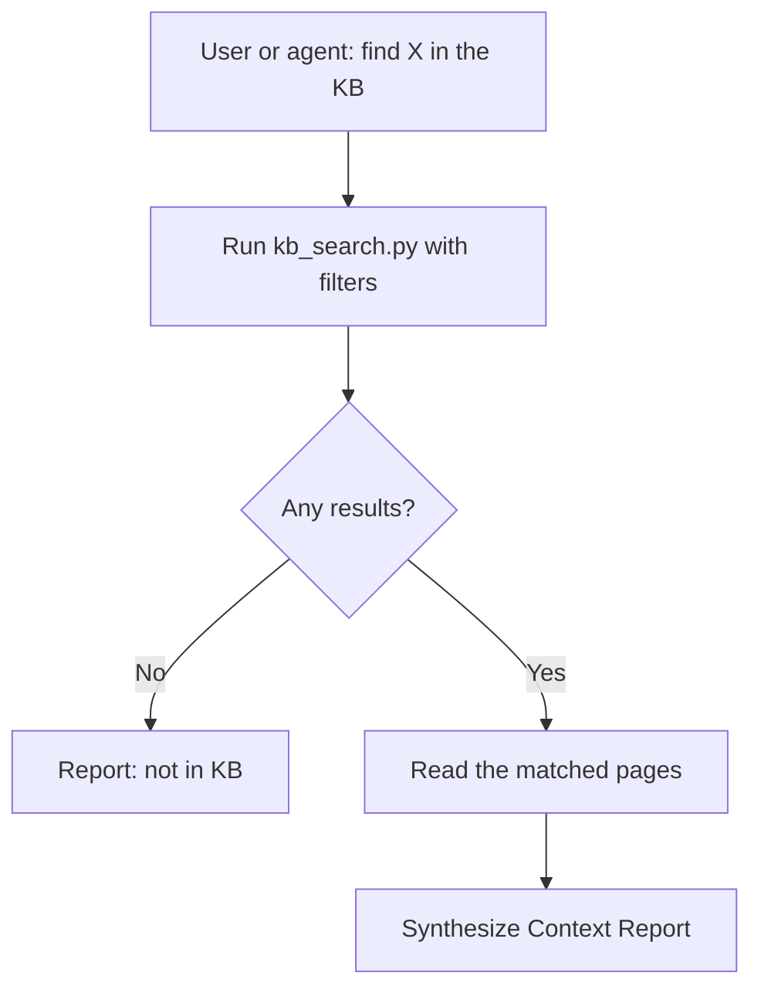

# KB Discovery Agent — Plan

## Summary

Create a narrowly scoped, read-only agent whose job is to search the research
wiki (`Knowledge-Base/`) and report what it finds. It is the "find" half of
the discovery/intake pair described in
`docs/plans/goals/stock_decision_support_system.md`'s Discovery Agent, and it
is also the pre-research step every write to the wiki (`kb-intake`) must run
first, so new research never duplicates or silently contradicts existing
pages.

## Agent and Skill Structure

```text
.claude/
├── agents/
│   └── kb-discovery.md
└── skills/
    └── kb-search/
        ├── SKILL.md
        ├── references/
        │   └── search-contract.md
        └── scripts/
            ├── kb_search.py
            └── validate_kb.py
```

`kb_search.py` and `validate_kb.py` import shared parsing/validation/index
helpers from `src/kb_pages.py` — that module is shared across all KB skills
(`kb-search`, `kb-sync-portfolio`, `kb-intake-document`, `kb-update-thesis`),
so it lives in `src/` rather than one skill's `scripts/`, per the "Python
used only by one skill lives beside that skill" rule in
`docs/architecture/claude_agent_skill_structure.md`.

## Fixed Workflow



## Why Read-Only

The discovery agent has no `Write`/`Edit` tools at all — not a prompt-level
restriction, a tool-level one. This makes it safe to invoke liberally (as a
pre-research step, as a direct user query) without any risk of it mutating
the wiki, and it keeps the "who writes to the KB" surface confined to
`kb-intake`.

## Tests and Acceptance Criteria

- `tests/test_kb_search.py` covers: query matches front matter and body,
  ranking (front-matter hits first), AND-combined filters
  (`--ticker`/`--type`/`--tag`/`--status`), empty results (no error), index
  pages excluded, `--limit` respected; and `validate_kb.py`'s front-matter
  validation, related-link resolution, and `--fix-indexes` index rebuilding.
- Manual acceptance: `kb_search.py --ticker AAPL` against the real
  `Knowledge-Base/` returns `portfolio/holdings.md` (and any `stocks/AAPL.md`
  page once one exists).
- `validate_kb.py --fix-indexes` run against the real `Knowledge-Base/`
  exits 0.

## Assumptions

- Search is deterministic front-matter/text matching, not semantic/embedding
  search — sufficient for a wiki of this size and keeps the workflow
  auditable.
- The agent trusts `kb_search.py`'s ranking; it does not re-rank or filter
  results itself beyond reading the top matches.
- `theses/index.md`, `logs/index.md`, and `taxonomy/index.md` are hand-
  curated navigation pages without a `kb-index` marker table and are
  excluded from `--fix-indexes` auto-rebuild by design.
