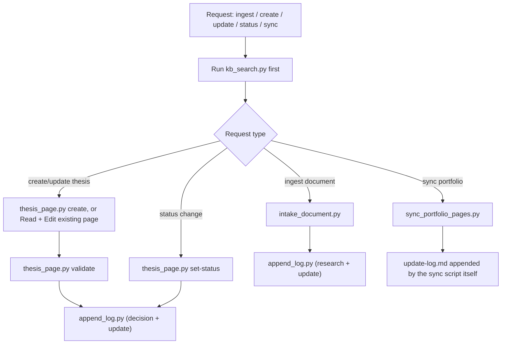

# KB Intake Agent — Plan

## Summary

Create the agent that brings information into the research wiki: document
ingestion via markitdown, the goal doc's thesis-update logic (create/update
stock pages while preserving Original Thesis and Decision History), status
transitions, and portfolio data sync. This is the "write" half of the
discovery/intake pair — `kb-discovery` finds, `kb-intake` writes.

## Agent and Skill Structure

```text
.claude/
├── agents/
│   └── kb-intake.md
└── skills/
    ├── kb-intake-document/
    │   ├── SKILL.md
    │   ├── references/intake-contract.md
    │   └── scripts/intake_document.py
    └── kb-update-thesis/
        ├── SKILL.md
        ├── references/thesis-contract.md
        └── scripts/
            ├── thesis_page.py
            └── append_log.py
```

`kb-intake` also depends on `kb-search` (mandatory first step) and
`kb-sync-portfolio` (already built for the standalone sync use case).

## Fixed Workflow



## Why Judgment Lives Outside the Scripts

The deterministic scripts (`create`, `validate`, `set-status`,
`intake_document.py`, `sync_portfolio_pages.py`) handle structure,
allowlists, and append-only logging — anything that must be enforced, not
just described. Comparing an existing thesis's assumptions against new
information and deciding whether it's stronger/weaker/unchanged/broken
cannot be scripted; that's why this agent (unlike every other agent in the
repo) uses `Read`/`Edit` directly on wiki pages, and why it runs on `sonnet`
rather than `haiku`.

## Why Search Comes First, Unconditionally

Without a mandatory `kb-search` step, the agent could create a duplicate
`stocks/TICKER.md` for a ticker that already has a page, or write an
"Updated Thesis" that silently contradicts an existing Original Thesis it
never read. The `kb-update-thesis/SKILL.md` workflow makes this explicit as
step 1, not a suggestion.

## Tests and Acceptance Criteria

- `tests/test_kb_intake_document.py`: extension/path allowlists, source page
  creation, companion note scaffolding per `--dest-folder`, doc-type
  override, duplicate-page refusal, index/log updates. markitdown itself is
  mocked (`intake_document.convert_to_markdown` patched) so tests don't
  require the dependency or network/file-conversion behavior.
- `tests/test_kb_thesis_scripts.py`: `create` (classification pre-fill,
  duplicate refusal, index/log updates, unheld-ticker default),
  `validate` (valid page, missing section, wrong type), `set-status`
  (front matter + Status block + thesis-view regeneration, missing-page
  error), and `append_log.py` for all three log types including required-
  argument validation.
- Manual acceptance (see the phase-1 implementation plan,
  `docs/plans/implementation/stock_decision_support_phase1.md`): ingest a
  sample document end to end; create a thesis for a real holding and run a
  second update pass confirming Original Thesis is untouched, Updated
  Thesis changed, and Decision History plus logs gained new rows.

## Assumptions

- markitdown's conversion quality is a starting point for the source page,
  not a finished research note — the companion note is a scaffold the agent
  fills in, not markitdown output directly.
- Thesis pages are one-per-ticker (`stocks/TICKER.md`); there's no
  versioned/multiple-thesis-per-ticker model — Decision History and Updated
  Thesis carry the change record instead.
- `append_log.py` enforces append-only by construction (it has no
  edit/delete code path), so log integrity doesn't depend on agent
  discipline alone.
