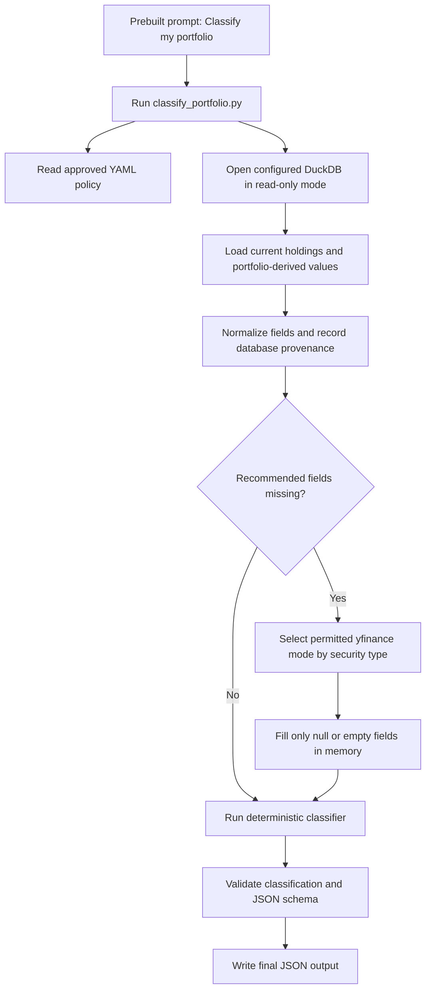

# Constrained Portfolio Classification Agent

## Summary

Create one narrowly scoped agent whose only supported task is:

> Classify my portfolio.

The agent will run a deterministic, read-only workflow. It will read portfolio data from DuckDB, identify missing recommended classification fields, fetch only permitted missing fields from yfinance, classify holdings using the approved YAML rules, and produce JSON. It cannot execute arbitrary SQL, select arbitrary yfinance properties, modify the database, or invent a new workflow.

## Agent and Skill Structure

```text
.codex/
+-- agents/
    +-- portfolio-classifier.toml

.agents/
+-- skills/
    +-- classify-portfolio/
    |   +-- SKILL.md
    |   +-- agents/
    |   |   +-- openai.yaml
    |   +-- references/
    |   |   +-- workflow-contract.md
    |   |   +-- output-contract.md
    |   +-- scripts/
    |       +-- classify_portfolio.py
    +-- read-portfolio-classification-data/
    |   +-- SKILL.md
    |   +-- references/
    |   |   +-- database-contract.md
    |   +-- scripts/
    |       +-- read_classification_data.py
    +-- fetch-yfinance-classification-data/
        +-- SKILL.md
        +-- references/
        |   +-- yfinance-contract.md
        +-- scripts/
            +-- fetch_classification_data.py
```

The `portfolio-classifier` agent receives a prebuilt prompt that requires it to invoke only `classify_portfolio.py`. Supporting scripts are implementation details of that workflow and are not exposed as general-purpose agent tools.

The optional `agents/openai.yaml` file contains only skill presentation metadata, such as its display name, short description, and prebuilt default prompt. It does not grant permissions or enforce read-only behavior. Those controls belong in the scripts and agent configuration.

The agent definition will explicitly prohibit:

- Arbitrary shell or Python code.
- Arbitrary SQL or database paths.
- Database inserts, updates, deletes, migrations, or schema changes.
- Direct use of the general-purpose yfinance API.
- User-selected yfinance properties.
- Editing classification YAML.
- Persisting enrichment results.
- Producing classifications outside the approved deterministic rules.

## Fixed Workflow



Processing rules:

1. Load the approved knowledge-base files, including required fields, classification rules, overrides, policy, references, and examples.
2. Open only the configured portfolio database using DuckDB `read_only=True`.
3. Determine current holdings from transactions and join approved ticker, stock, ETF, provider-symbol, and portfolio-summary data.
4. Build one normalized record per holding.
5. Treat nulls, blank strings, and unavailable values as missing.
6. Preserve every non-empty database value. Yfinance must never overwrite database data.
7. Request only missing, yfinance-supported classification fields.
8. Keep yfinance responses in memory for the duration of the run.
9. Apply manual overrides and deterministic YAML rules in the existing priority order.
10. Mark holdings `Needs Review` when required evidence remains missing or rules conflict.
11. Validate the complete result and write JSON. No database or cache writes are permitted.

A failure for one ticker must not abort the portfolio. That ticker receives an enrichment error and proceeds to classification or `Needs Review`. Database-access, policy-loading, or output-validation failures stop the complete run and return a non-zero exit code.

## Script Contracts and Controls

### Read-only database script

`read_classification_data.py` will expose no SQL argument and no production database-path argument. It will read the database path from the existing project configuration.

Its internal queries will be hard-coded and parameterized. It will return only:

- Current holdings.
- Ticker identity, name, type, exchange, and currency.
- Existing stock sector and industry.
- Existing ETF metadata.
- Current quantity, market value, weight, and cost information where derivable.
- Purchase and sale counts and dates.
- Dividends received.
- Account context where available.
- Verified yfinance provider symbols.

The script will reject an inactive or incompatible schema. Tests may call internal Python functions with temporary fixture paths, but the production CLI will not expose that option.

### Restricted yfinance script

`fetch_classification_data.py` will accept a normalized JSON request from the orchestrator, not free-form field names.

The script will have three internal modes selected automatically by security type:

- `identity`: company name, quote type, exchange, listing currency, and financial currency.
- `equity-classification`: identity fields plus sector, industry, dividend yield, and market capitalization.
- `etf-classification`: identity fields plus fund family, fund category, yield, assets under management, expense ratio, NAV, holdings summary, and sector weights.

These are classification-only modes. Price history, live quotes, analyst data, news, options, financial statements, and arbitrary `.info` access are outside this version.

Controls include:

- Tickers must originate from the database workflow.
- Provider symbols must come from verified mappings or the existing controlled resolver.
- Requests have fixed field allowlists and batch-size limits.
- Unknown modes and fields fail validation.
- Raw yfinance objects are never returned.
- Results are normalized into JSON-safe values.
- Network failures are captured per ticker.
- No result is written to DuckDB or a cache file.

### Classification orchestrator

The public command will be equivalent to:

```powershell
python .agents/skills/classify-portfolio/scripts/classify_portfolio.py
```

Optional public arguments will be limited to:

```text
--output <json-path>
--pretty
```

The default output will be a project-local generated JSON file. The script will reject output paths outside the configured output directory. It will not accept tickers, SQL, rule paths, modes, or field lists.

## Field Source Priority

| Classification field | Database source | Yfinance fallback | Final fallback |
|---|---|---|---|
| ticker | `tickers` | Never | Fatal record error |
| company_name | `tickers.security_name` | Identity mode | Missing |
| asset_class | `tickers.security_type` | Quote type or fund category | Missing |
| currency | `tickers.currency` | Identity mode | Missing |
| exchange | `tickers.exchange` | Identity mode | Missing |
| sector | `stock_details.sector` | Equity mode | Missing |
| industry | `stock_details.industry` | Equity mode | Missing |
| etf_category | Existing ETF metadata when mappable | ETF mode | Missing |
| dividend_yield | `etf_details.yield`; otherwise unavailable | Equity or ETF mode | Missing |
| market_cap | Not currently stored | Equity mode | Missing |
| current_weight_percent | Derived from portfolio database values | Never | Missing |
| position_market_value | Derived from holdings and prices in database | Never | Missing |
| purchase and sale dates and counts | `transactions` | Never | Missing |
| dividends_received | Transaction or email sources using existing source rules | Never | Missing |
| account_type | Portfolio transaction source when available | Never | Missing |
| user_thesis | Not currently stored | Never | Missing |
| target_weight_percent | Not currently stored | Never | Missing |
| review fields | Classification input and rules | Never | Generated |

Yfinance cannot supply user thesis, target weights, transaction history, account type, portfolio weights, portfolio market value, or review decisions.

## JSON Output Contract

The top-level object will contain:

```json
{
  "schema_version": "1.0",
  "generated_at": "ISO-8601 timestamp",
  "workflow": "classify-my-portfolio",
  "database_mode": "read_only",
  "summary": {
    "holding_count": 0,
    "classified_count": 0,
    "review_count": 0,
    "enrichment_attempted": 0,
    "enrichment_failed": 0
  },
  "holdings": []
}
```

Each holding will contain:

- `ticker`
- `company_name`
- `primary_group`
- `secondary_tags`
- `confidence`
- `reasoning`
- `evidence_used`
- `missing_data`
- `review_needed`
- `fields`, containing normalized recommended and portfolio-context fields
- `field_provenance`, mapping each field to `database`, `yfinance`, `derived`, `manual_override`, or `missing`
- `enrichment`, containing mode, attempted fields, populated fields, and errors

Sensitive raw transaction rows and unrestricted yfinance payloads will not appear in output.

## Tests and Acceptance Criteria

- Verify the database opens in read-only mode and remains byte-for-byte unchanged.
- Verify scripts expose no SQL, database mutation, ticker-selection, yfinance-field, or mode-selection arguments.
- Verify database values always take precedence over yfinance values.
- Verify only missing allowlisted fields are requested and merged.
- Mock each yfinance mode for equities, ETFs, unknown securities, partial responses, timeouts, and invalid symbols.
- Verify user thesis and portfolio-only fields are never requested from yfinance.
- Verify manual overrides remain highest priority.
- Verify incomplete and conflicting records become `Needs Review`.
- Verify one failed ticker does not abort other classifications.
- Verify invalid YAML, an inaccessible database, or invalid output fails safely.
- Validate skill metadata with the skill-creator validation utility.
- Run deterministic unit tests without live network access, plus one opt-in yfinance smoke test.
- Require the prebuilt `Classify my portfolio` prompt to produce schema-valid JSON without modifying the portfolio database or exposing an open-ended tool.

## Assumptions

- Version one exposes only the complete `Classify my portfolio` workflow.
- Yfinance enrichment is ephemeral and classification-only.
- JSON is the only output format.
- Existing YAML files remain the source of truth for classification.
- Existing portfolio data is authoritative whenever populated.
- No new database columns or migrations are included.
- Restrictions are enforced in executable wrappers, not merely described in prompts.
