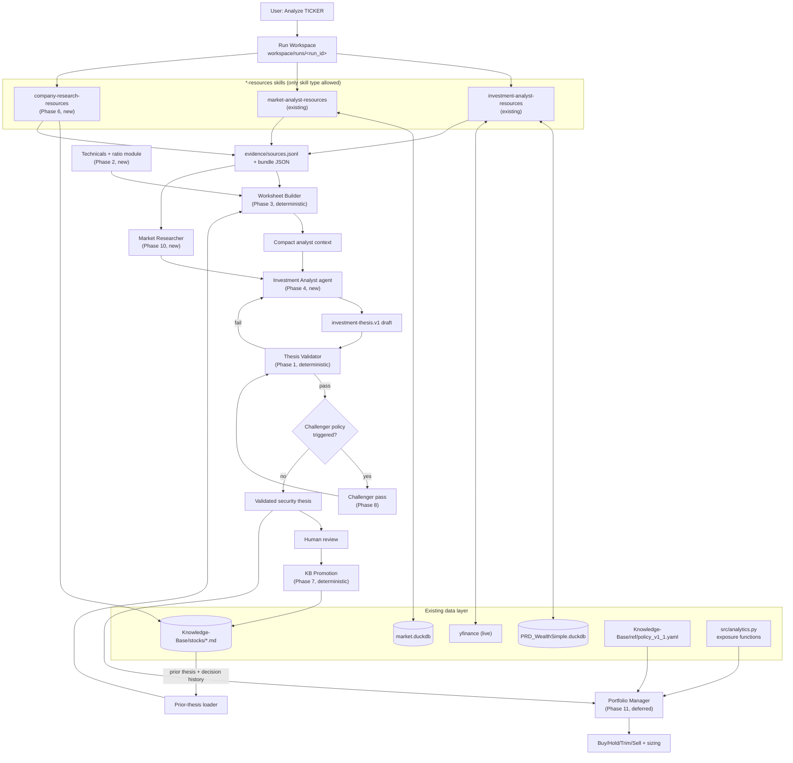
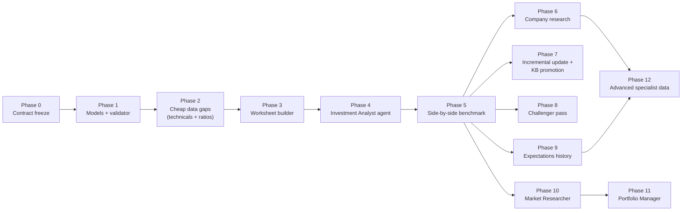

# Investment Analyst rebuild — phased build roadmap

**Status:** approved rollout plan. Execute from this file, phase by phase.
**Companion document:** [stock-analysis-agent-design-review.md](stock-analysis-agent-design-review.md) (Document A) — the factual gap analysis this roadmap's "Closes" column references.
**Also related:** [`combined-investment-analyst-plan/00-overview.md`](combined-investment-analyst-plan/00-overview.md) — the existing 12-phase synthesis this roadmap sharpens into file-level specifics and a concrete build order, with one reordering: cheap data-gap closures move before the analyst/benchmark phases.

This file is git-tracked and self-contained: any future CLI session can reference it and pick up execution at whichever phase is next.

---

## Phase execution protocol — hard stop after every phase

1. **Work stops at the end of every phase.** No auto-continuation into the next phase within the same turn or session unless explicitly told to proceed.
2. **At each stop, present, before asking for anything else:**
   - the list of files created or modified (full paths);
   - a diff or diff-equivalent summary (`git diff --stat` plus the substantive changes, not just line counts);
   - the result of running that phase's verification (test output, script output, or the specific check named in its Gate);
   - which Gate condition was met, stated plainly, not assumed.
3. **The human reads the actual changes** — via the diff presented, `git log`/`git diff` directly, or a request to see a specific file — before approving.
4. **Approval is explicit and per-phase.** Approving Phase 2 does not pre-approve Phase 3. Batch approval ("go ahead through Phase 5") is a decision the human makes explicitly each time, never a default.
5. **Each phase is committed on `Agent-Development`** as its own commit (or small commit set) before the stop, so the diff under review is exactly what's already saved.
6. **If a phase's Gate condition fails**, report the failure and stop there rather than partially proceeding into the next phase.

---

## Phase table

| # | Phase | Goal | Key deliverables | Closes (Doc A §6 / §2) | Gate |
|---|---|---|---|---|---|
| Setup | Documents in place | Get both planning documents in the main tree | This file; Document A; untracked `combined-investment-analyst-plan` reference material | — | Both documents committed on Agent-Development; `combined-investment-analyst-plan` either gitignored or tracked |
| 0 | Contract & responsibility freeze | Lock schemas, vocabulary, and scope before any code | `investment-thesis.v1` + `analysis-scope.v1` schema drafts, `Knowledge-Base/taxonomy/investment-analysis-policy.yml` draft, example valid/invalid artifacts, TRACE thresholds filled in, Portfolio Manager vocabulary decision recorded | Doc A §7 (TRACE blanks, PM vocabulary) | Schema, vocabulary, and both open decisions from Doc A §7 approved in writing |
| 1 | Thesis models & validator | Deterministic Python validator exists before the agent does | `src/workspace/analysis_models.py`, `src/workspace/thesis_validation.py`, `tests/test_investment_thesis_validation.py` | — | Fixtures for valid/warning/invalid all pass; a fabricated evidence ID and a `target_weight` field both fail validation |
| 2 | **Cheap data-gap closure** *(inserted ahead of the analyst — not the combined plan's original order)* | Close the two gaps needing no new data source before judgment work starts | `src/security_technicals.py` (moving averages, drawdown, volatility, relative strength vs. `XEQT.TO`, built on existing `historical_records` OHLCV; beta/alpha by **importing** `portfolio_metrics.calculate_benchmark_stats`) + a normalized ratio module (EV/EBITDA, EV/Revenue, Debt/EBITDA, ROE, ROIC, PEG) + fix for the `return_30d==90d==365d` mislabeling defect in `derived_metrics.py`. **Reuse boundary below — `src/portfolio_metrics.py` is not modified.** | Doc A §6: moving-averages/beta/drawdown/volatility/relative-strength row; EV/EBITDA/ROE/ROIC/PEG row; 30/90/365-day return defect | Unit tests against a known-OHLCV fixture reproduce hand-computed beta/drawdown/MA/ratio values; windowed returns are correctly labelled or marked insufficient-history rather than silently duplicated; `git diff --stat` shows no change to `src/portfolio_metrics.py` or `src/analytics.py` |
| 3 | Worksheet builder over `investment-analyst-resources` | First integration with the retained resource skill | `src/workspace/investment_worksheet.py`, `financial_metrics.py`, `valuation.py`, `scenarios.py` | Consumes Phase 2 outputs plus existing bundle fields | PLTR fixture produces a deterministic worksheet; a context-size ceiling test passes; TRACE `not_applicable` handling is preserved, not turned into a gap |
| 4 | Minimal Investment Analyst agent | First LLM judgment stage, built from scratch | `.claude/agents/investment-analyst.md` | — | Produces a valid thesis for the PLTR fixture; passes the Phase 1 validator; never reads the raw resource bundle directly; never writes the KB; repeated runs on identical input are materially stable |
| 5 | Side-by-side benchmark | Decide whether the new path earns its keep before adding breadth | Benchmark run set (one growth stock, one dividend/value stock, one TSX listing with FX complexity, one sparse-coverage name, one unowned/watchlist ticker, one ETF for routing-only) scored per the combined plan §13.2/§5 rubric | — | Comparison reviewed; outcome recorded as one of: full replacement / dual system / targeted adoption |
| 6 | Company primary-source research | Close filing/IR/segment/guidance gaps | `.claude/skills/company-research-resources/` (new `*-resources` skill) | Doc A §6: revenue segments/geography/customer concentration row; company guidance row | Skill returns registered, cited evidence for at least one filing-derived fact per benchmark-set ticker |
| 7 | Incremental update & safe KB promotion | Allow re-runs without rewriting untouched sections, with human review | `src/workspace/thesis_promotion.py`, scope-patch enforcement | — | A same-ticker incremental run leaves out-of-scope sections byte-identical; promotion requires explicit human approval |
| 8 | Challenger pass | Bounded second opinion, not a routine doubling of cost | New challenger agent definition, trigger policy | — | Challenger invoked only when policy triggers fire; produces disconfirming evidence or explicitly finds none |
| 9 | Expectations history & event intelligence | Close the single biggest Doc A gap: no revision history | Persistence layer for dated consensus/estimate snapshots | Doc A §6: analyst estimate revision history row | A second run on the same ticker after a new estimate shows a real revision delta, not a re-fetched identical snapshot |
| 10 | Market Researcher & market linkage | Turn `market-analyst-resources` data into judgment | New Market Researcher agent; fill highest-value `<TBD>` domains in `market-indicators.yml` | Doc A §6: macro/market context row | Market Researcher output is cited by at least one analyst thesis's macro-sensitivity section |
| 11 | Portfolio Manager | Resolve the PM-vocabulary decision and turn security theses into portfolio action | New Portfolio Manager agent consuming `get_sector_allocation`/`get_look_through_sector_exposure`/`get_currency_exposure` (`src/analytics.py`) plus `policy_v1_1.yaml` limits | Doc A §6: portfolio-level exposure row (functions exist, just unwired) | PM output enum resolved against a real taxonomy file (Phase 0's open decision closed here); a single-name-cap breach is correctly flagged |
| 12 | Advanced specialist data | Highest-cost, lowest-priority remaining gaps | Historical IV/OI persistence, 13F change history, insider transaction-code parsing | Doc A §6: IV percentile row; institutional 13F row; insider transaction-code row | Each targeted row in Doc A §6 flips from `[NOT BUILT]`/`[PARTIAL]` to `[BUILT]` with a cited source |

**Rollout notes:**
- Phases 0–5 are a strict critical path — nothing skips or reorders within it.
- Phases 6–12 are independent enough that after Phase 5's benchmark verdict, order (or inclusion) can change based on what the benchmark actually showed was missing.
- Every phase is a safe stopping point: nothing in Phase N assumes Phase N+1 exists.

---

## Phase 2 design decision — reuse boundary vs. the dashboard analytics layer

**Decided 2026-08-10. Option B: standalone per-security module, no refactor of the
dashboard's portfolio analytics.** Full record in
[`implementation/phase-2/design-decisions.md`](implementation/phase-2/design-decisions.md).

The question raised before Phase 2 began: does a technicals module duplicate what
`src/portfolio_metrics.py` already computes for the dashboard? Investigation found
the overlap is narrower than it looks and applies to only one of Phase 2's three
deliverables:

| Phase 2 deliverable | Overlap with the dashboard analytics layer |
|---|---|
| Technicals (MA, beta, drawdown, volatility, relative strength) | Formula-level only, ~3 functions. Existing code is **portfolio-level** (whole-portfolio valuation series); Phase 2 needs **per-security** (one ticker's OHLCV). No per-security risk metric exists anywhere in the repo or frontend today. |
| Ratio module (EV/EBITDA, EV/Revenue, Debt/EBITDA, ROE, ROIC, PEG) | **None.** Nothing in the repo computes these. |
| `return_30d==90d==365d` fix | **None.** The defect is in `.claude/skills/investment-analyst-resources/scripts/derived_metrics.py::_return_over` — the `else points[0][1]` fallback silently returns the same first-available price for all three windows when history is short. |

Rules Phase 2 follows:

1. **New `src/security_technicals.py`; do not modify `src/portfolio_metrics.py` or
   `src/analytics.py`.** Those are load-bearing for the dashboard's
   `/api/portfolio/report` and are currently correct. Refactoring them for a consumer
   that does not yet exist is premature, balloons the phase diff past its gate, and
   forces re-verification of `tests/test_analytics.py` / `tests/test_dashboard_api.py`
   for changes unrelated to Phase 2.
2. **Import `portfolio_metrics.calculate_benchmark_stats` for beta/alpha vs
   `XEQT.TO`.** Despite its portfolio-flavored parameter names it is already a generic
   "series A vs series B" function taking `[{date, return}]` rows, and it carries the
   conventions that actually matter (inner-join date alignment, `minimum_overlap`
   guard, risk-free handling). Reusing it costs one import and zero changes to
   existing code — which resolves the single strongest duplication concern outright.
3. **Write MA / drawdown / volatility / relative strength locally** as small pure
   functions over one price series, but **import `ANNUALIZATION_PERIODS` and
   `DEFAULT_RISK_FREE_RATE` from `src/config.py`** (already the shared source
   `portfolio_metrics.py` reads). Sharing the *constants* makes conventions match by
   construction without sharing code. Convention parity — `ddof=0`, same annualization —
   is stated in the module docstring.
4. **Defer any extraction of shared primitives** out of `portfolio_metrics.py` until a
   real second consumer exists — realistically when `/holdings/[symbol]` surfaces
   per-security beta. Refactor with two known consumers, not one speculative one.

This is consistent with existing repo precedent: `derived_metrics.py` (lines 15–20)
records a deliberate decision to *port* pure math from `scoring_worksheet.py` rather
than import it, to keep research tracks independent.

**The duplication risk Phase 2 must actually manage is not the dashboard — it is
`derived_metrics.py`.** That module already derives `_debt_to_equity` and
`_current_ratio` from the same `financial_snapshots` rows the new ratio module will
read. Two modules producing leverage ratios from one table with possibly different
period conventions is a live conflict. The ratio module must either extend that file
or explicitly supersede those two functions — and say which, in writing.

---

## Diagram 1 — runtime interaction (target state once fully built)

Components from later phases are shown so you can see where they attach; this is the destination, not what exists after any single phase.



## Diagram 2 — phase build order (dependency graph)



Reading this graph: Phases 0→5 are a single line — no branching, no skipping. After Phase 5's benchmark verdict, Phases 6–10 fan out and can be built in any order (or dropped) depending on what the benchmark showed actually mattered; Phase 11 waits on Phase 10 because a Portfolio Manager needs at least a starting market view; Phase 12 waits on whichever of Phase 6/9 supplied the specialist data it extends.

---

## Verification quick-reference

Run from the main tree:

```bash
python -m unittest discover -s tests -p 'test_investment*.py'   # Phases 1, 3, 4, 7 as they land
python -m unittest tests.test_security_technicals                # Phase 2
```

Data-availability spot checks:
```bash
python -c "import json,glob; d=json.load(open(sorted(glob.glob('exports/investment-analyst-resources/*-resources.json'))[-1],encoding='utf-8')); print(list(d['db'])); print(list(d['derived'])); print(d['trace']['completeness_pct'])"
```

Each phase's own Gate (see table above) is the authoritative check for that phase — this section is a starting point, not a substitute.
